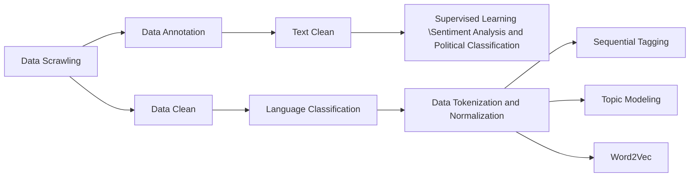

# SDSC3013 Project - CityUHK

We used Twitter API to scrawled 4799 tweets on the topic of US Election 2024 from X (Twitter)

# Guidence

[Data Scrawling](https://github.com/ronineume/X-NLP-Project/blob/main/Data_preparation/guide.md)
# Packges
TextBlob, Gensim, spaCY

# Data preparation

# Description of dataset (After Data Clean)
| Field                     | Type                    | Description                                                                                                                             |
|---------------------------|-------------------------|-----------------------------------------------------------------------------------------------------------------------------------------|
| `edited`                  | integer                   | 0: No edits ; 1: Tweet is edited |
| `tweets_created_at`       | Y-m-d H:M:S (UTC)        | Creation time of the Tweet.                                                                                                            |
| `tweet_id`                      | integer                 | Unique identifier of this Tweet. This is returned as a string in order to avoid complications with languages and tools that cannot handle large integers. |
| `author_id`              | integer                  | Unique identifier of this user. This is returned as a string in order to avoid complications with languages and tools that cannot handle large integers. |
| `text`                    | string                  | The content of the Tweet.                                                                                                              |
| `retweet_count`          | integer                 | Number of times this Tweet has been Retweeted.                                                                                         |
| `reply_count`            | integer                 | Number of Replies of this Tweet.                                                                                                        |
| `tweet_like_count`             | integer                 | Number of Likes of this Tweet.                                                                                                          |
| `quote_count`            | integer                 | Number of times this Tweet has been Retweeted with a comment (also known as Quote).                                                    |
| `bookmark_count`         | integer                 | Number of times this Tweet has been bookmarked.                                                                                         |
| `impression_count`       | integer                 | Number of times this Tweet has been viewed.                                                                                            |
| `referenced_tweet_types` | integer                    | Indicates the type of relationship between this Tweet and the Tweet returned in the response: retweeted, quoted, or replied_to. 0: Original 1: replied_to 2: quoted 3: 'quoted', 'replied_to'       |
| `name`                  | string                   | The name of the user, as they’ve defined it on their profile. Not necessarily a person’s name. Typically capped at 50 characters, but subject to change. |
| `username`       | string        | The Twitter screen name, handle, or alias that this user identifies themselves with. Usernames are unique but subject to change. Typically a maximum of 15 characters long, but some historical accounts may exist with longer names.|
| `description`                      | string                | The text of this user's profile description (also known as bio), if the user provided one. |
| `followers_count`              | integer                  | The number of followers this account currently has. Under certain conditions of duress, this field will temporarily indicate “0”. |
| `following_count`                    | integer                  | The number of accounts that the user is following.                                                                                                             |
| `tweet_count`          | integer                 | The total number of Tweets (including retweets) that the user has posted since they created their account.             |
| `listed_count`            | integer                 | The number of public lists that this user is a member of.                                                                                                      |
| `user_like_count`             | integer                 | The number of Tweets this user has liked in the account’s lifetime.                                                                                                          |
| `verified`          | integer                 | Indicates if this user is a verified Twitter User.   1:verified 0:not verified                                                                                    |
| `user_created_at`            | Y-m-d H:M:S (UTC)            | The UTC datetime that the user account was created on Twitter.                                                                                                        |
| `location`             | string                 | The location specified in the user's profile, if the user provided one. As this is a freeform value, it may not indicate a valid location, but it may be fuzzily evaluated when performing searches with location queries. |

# Analysis
Sentiment Analysis (BERT)\
Political leanigns Analysis (Naive Bayes) \
Word2Vec \
Squential Tagging \
Topic Modeling (LDA Model)

# Result

# References
[twitter_api_tutorial](https://github.com/nestauk/dap_medium_articles/tree/dev/twitter_api_tutorial) \
[X API Usage](https://developer.x.com/en/docs/x-api/tweets/search/api-reference/get-tweets-search-recent) \
[徒手搓LLM）逐行代码从0构造一个LLM——LlaMa篇](https://zhuanlan.zhihu.com/p/1674261485) \
[llama3 model.py](https://github.com/meta-llama/llama3/blob/main/llama/model.py) \
[Analyzing voter behavior on social media during the 2020 US presidential election campaign](https://pmc.ncbi.nlm.nih.gov/articles/PMC9288921) \
[Distantly-Supervised Named Entity Recognition with Noise-Robust Learning and Language Model Augmented Self-Training](https://arxiv.org/abs/2109.05003) \
[Twitter数据挖掘及其可视化](https://www.hrwhisper.me/twitter-data-mining-and-visualization/) \
[Gensim](https://radimrehurek.com/gensim/auto_examples/index.html#documentation) \
[textblob](https://textblob.readthedocs.io/en/dev/) \
[计算传播学](https://chengjun.github.io/mybook/11-3-textblob.html) \
[spaCY](https://spacy.io/) \
[Topic Modeling using Gensim-LDA in Python](https://medium.com/analytics-vidhya/topic-modeling-using-gensim-lda-in-python-48eaa2344920) \
[Topic Modeling](https://ethen8181.github.io/machine-learning/clustering/topic_model/LDA.html#Getting-Started) \
[Sentiment Analysis using BERT Kaggle](https://www.kaggle.com/code/prakharrathi25/sentiment-analysis-using-bert/notebook) \
[Google News and Leo Tolstoy: Visualizing Word2Vec Word Embeddings using t-SNE](https://towardsdatascience.com/google-news-and-leo-tolstoy-visualizing-word2vec-word-embeddings-with-t-sne-11558d8bd4d)
        

